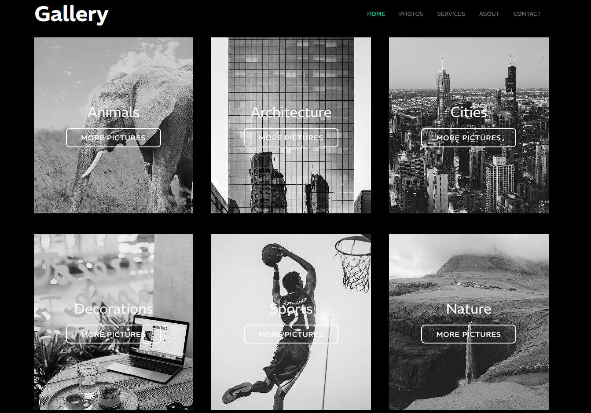

<h1 align="center"> Gallery </h1>

  Event promoted by Matheus Battisti for teaching WEB technologies.

## 📖 Index

  <a href="#-technologies">Technologies</a>&nbsp;&nbsp;&nbsp;|&nbsp;&nbsp;&nbsp;
  <a href="#-project">Project</a>&nbsp;&nbsp;&nbsp;|&nbsp;&nbsp;&nbsp;
  <a href="#-learning">Learning</a>&nbsp;&nbsp;&nbsp;|&nbsp;&nbsp;&nbsp;
  <a href="#memo-license">License</a>

  

 

  

## 💻 Project

Gallery is a photo gallery project with some basic animations.

## 🚀 Technologies

This project was developed with the following technologies:

- HTML.
- CSS. 
- Sass.
- Git and GitHub.

## 🧠 Learning

In this project i learned;

- Sass.
- Mixins creation. 
- Use of mixins.
- Concept of partials.
- Use of partials.
- Nesting.

## :memo: License

This project is lincensed under MIT.

---
